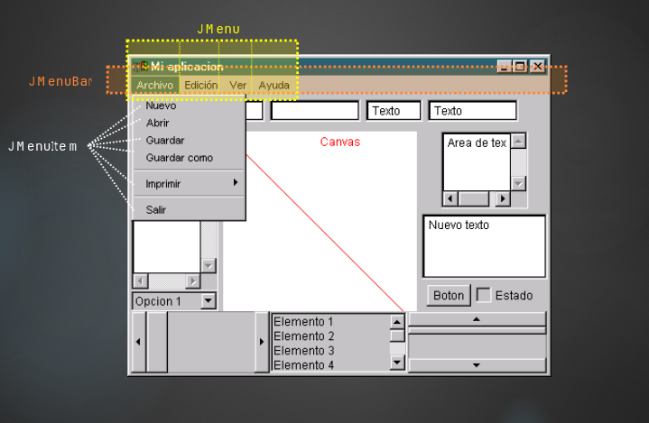
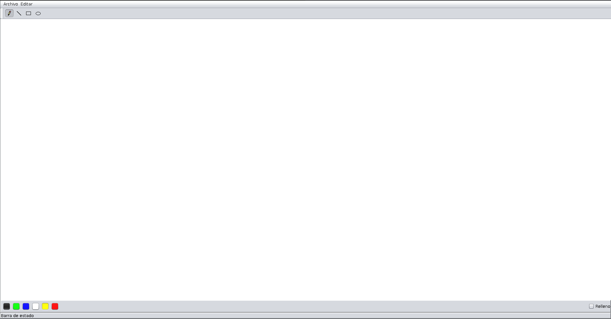
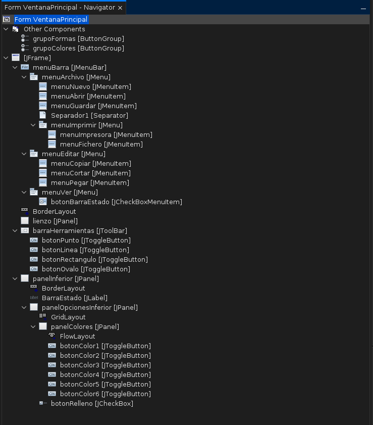

El objetivo de esta práctica es probar los distintos elementos que ofrece la Swing para el
diseño de interfaces gráficas de usuario (componentes, contenedores, manejadores de disposición, menús, etc.). Para ello, usaremos el entorno NetBeans y las herramientas visuales que ofrece

https://docs.oracle.com/javase/tutorial/uiswing/index.html

## Objetos 
objetos asociados a elementos ""visuales de la aplicacion"
- Tenemos Etiquetas Botones, Casilla activacion, Lista desplegables CVapos de texto Areas de texto , etc (Swing Controls)
- En InitComponents del JFrame de la Ventana Principal se iran añadiendo los componentes que hayamos seleccionado 
- Look&feel del main es donde podemos seleccionar theme para el proyecto (adicional)

tamaño objeto : setBounds(x,y,ancho,alto)
## Layouts (Manejadores disposición)
Determinan en qué posición y con qué tamaño se van a distribuir los componentes dentro del contenedor
- FlowLayout:  Distribuye los componentes de izquierda a derecha horizontalmente, mientras quepan en la línea, antes de pasar a la línea siguiente. El tamaño del componente será el predeterminado

- BorderLayout: Distribuye los componentes en cinco zonas distintas: norte, sur, este, oeste y centro. En cada zona solo habrá un componente (visible) y este ocupará toda la zona

- GridLayout: Distribuye los componentes en una matriz MxN en la que todas las celdas tienen el mismo tamaño. El componente ocupará toda la celda.

anular Layout: setLayout(null)

## Contenedores
Un contenedor es un objeto que puede contener a otros componentes. Un contenedor es a su vez un componente, por lo que puede estar contenido en otro contenedor
- Marco (Frame), ventara (WIndow), Dialogo, Panel
- Asociado a un contenedor hay un manejador de disposicion

## Menus

## Practica 

- [x] Crear un proyecto en NetBeans , Java with Ant -> Java application 
- [x] Añade un JFRAME usando plantilla Netbeans
	- (Añadir Archivo → Swing GUI Forms → JFrame Form);
	- Llamalo VentanaPrincipal
	- Cambia el metodo main de la clase principal por el que hay en la clase ventada (y eliminarlo de esta ultima)

 - [x] Añade componentes Swing 
	 - MIra los "Swing Controls"
	 - ver las propiedades en Properties 

 - [x] MIra los manejadores de disposicion FlowLayour
	 - Pulsando con el botón izquierdo sobre el JFrame, en la opción “Set Layout” del menú, seleccionar el manejador “Flow Layout”

 - [x] MIra lso distintos contenedores 
	 - Swing containers
	 - Para una evaluación más organizada, se aconseja, sobre la ventana vacía de componentes, activar el manejador de disposición “BorderLayout” y poner en el centro un panel tabulado (TabbedPane) sobre el que añadir varios paneles simples; en cada uno de estos paneles, a su vez, probar otros contenedores.

 - [x] Añade lun menu a la ventana principal
	 - Usamos los Swing Menus de la paleta de netbeas

### Extra: Practica 4 GUI
Realiza el siguiente diseño:

Aquí dejo el árbol de componentes resultante, cualquier duda consultar el mismo proyecto:

