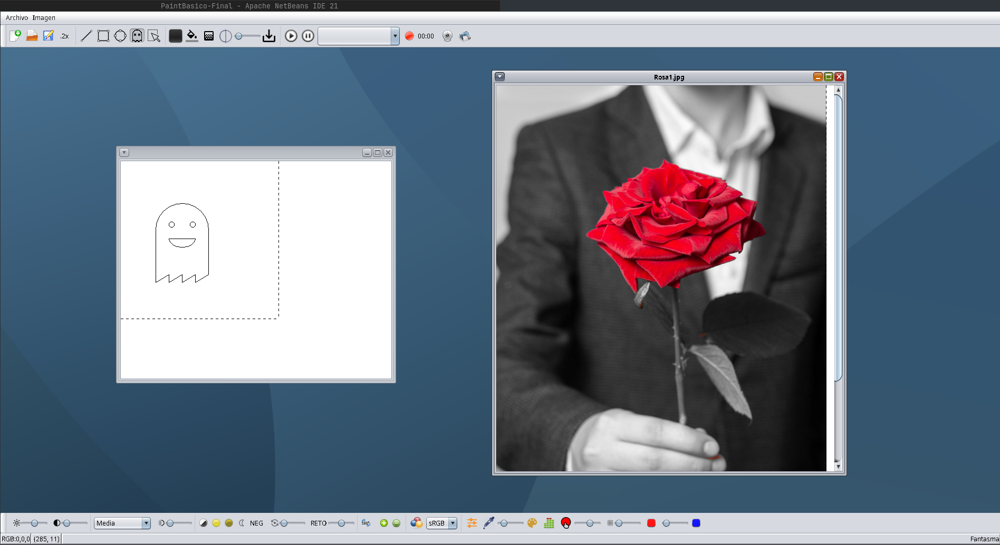
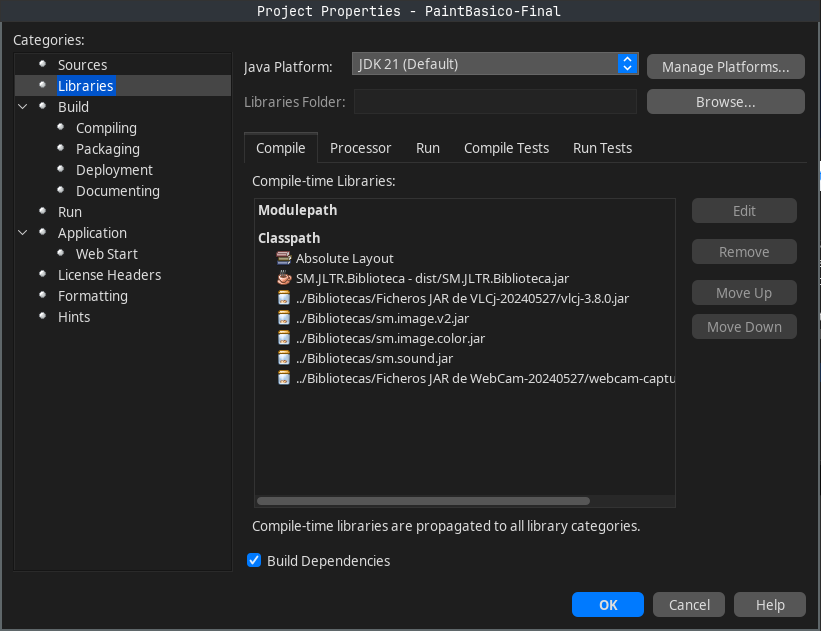

# Practicas_SMM
**Paint en Java con Netbeans**
- Torres Ramos, Juan Luis

## Contenidos Realizado
### P1 - Fundamentos Java
### P2 - Interfaces de Usuario en Java (Swing)
### P3 - Gestión de Eventos en Java
### P4 - Paint Básico
### P5 - Gráficos 2D: Formas Básicas
### P6 - Gráficos 2D: Atributos
### P7 - Paint 2D
### P8 - Entrada/Salida de Imágenes
### P9 - Procesamiento de Imágenes: RescaleOp y ConvolveOp
### P10 - Procesamiento de Imágenes: AffineTransformOp y LookupOp
### P11 - Procesamiento de Imágenes: BandCombineOp y ColorConvertOp
### P12 - Procesamiento de Imágenes: Sepia, Ecualización, Tintado, etc.
### P13 - Sonido
### P14 - Video + Webcam
### Trabajo voluntario de sonido 

## Retos Implementados

- **P3:** Ejercicios extra
- **P6:** Formas avanzadas
- **P8:**
  - Marcar figura seleccionada (multiselección)
  - Editar atributos de figura seleccionada
  - Volcar imagen
  - Clip de la imagen + rectángulo + botones se actualizan según el lienzo seleccionado
  - Filtros para guardar imagen en formatos JPG, BMP, PNG (tamaño de la imagen nueva no implementado)
- **P9:**
  - EventoListener (no terminado)
  - Emborronamiento iluminado
  - Emborronamiento cometa (por terminar, preguntar al maestro)
  - Crear imagen nueva que sea TYPE_INT_ARGB
  - Selección de figura del lienzo actualice la barra de herramientas (no hecho)
- **P10:**
  - Oscurecer zonas claras
  - Transformación lineal con un punto de control (por revisar)
  - Operación negativo
  - Operación duplicar x2
- **P11:** 
  - Mostrar en la barra de herramientas el valor RGB del píxel (hecho para el escritorio pero no para el lienzo, por terminar)
- **P12:**
  - Cambio de color c1 por c2
  - Añadido slider para operación rojo y tintado
- **P13:**
  - Listener para audio, contador de tiempo
- **Otros**
  - Listener para lienzo, para agregar figura, mostrar coordenada y color RGB
  - Listener para audio, contador de tiempo
  - Código documentado con Javadoc
  - Copia dura del lienzo, se puede copiar tanto imagen como figuras del lienzo en una nueva
  - Trabajo Voluntario de Sonido 

## Problemas 

- No puede abrir videos debido a problemas de librerías VCL.
  - SLF4J: Error al cargar la clase "org.slf4j.impl.StaticLoggerBinder".
  - SLF4J: Revirtiendo a implementación de logger sin operación (NOP).
  - SLF4J: Ver [SLF4J StaticLoggerBinder](http://www.slf4j.org/codes.html#StaticLoggerBinder) para más detalles.
  - VCL no encontrado.

## Librerias
Hay que enlazar primero las librerias con el proyecto, use como referencia los pdf del RoadMap, aqui hay un ejemplo para que corra el programa

## Nota
Si es la primera vez que descarga el proyecto, verifique que todas las librerías de la carpeta de biblioteca están asociadas al proyecto.
