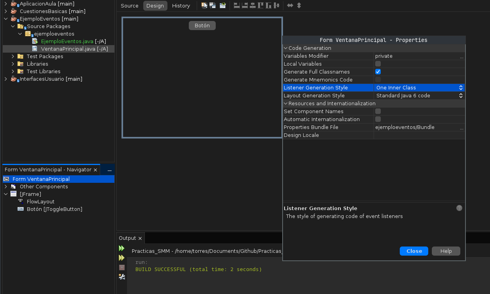

# P3 - Gestión de eventos en JAVA

## Eventos

1. Roles
	- En el proceso de gestión de eventos intervienen tres objetos: generador, evento y manejador

2. Generadores de eventos
	- Objetos que generan evento (al pulsar un botón por ejemplo)
	- motivo = la clase del evento 
	- los elementos IU de la Swing ("JButton, Jlist, etc) generan eventos
	- puedes crear clases propias que sean generadoras

3. Eventos
	- Objeto que representa "que algo ha pasado" y contiene info sobre "lo que ha pasado"
	- tipo evento = clase (heredada de Event: MouseEvent, KeyEvent, WindowEvent)

4. Manejador eventos
	- Objetos que “capturan” un evento “lo procesan” y dan una respuesta/acción
	- cada tipo evento tiene su manejador correspondiente
		- MouseEvent -> MouseAdapter
	- En la clase manejadora habrá métodos asociados a los diferentes "motivos" que han podido generar el evento. Cuando el manejador "capture" el evento, ejecutará el metodo de su clase asociado al motivo que provoco el evento

5. Pasos Manejador eventos
	1. Definir la clase manejadora
		1. Herendado de la clase asociada al tipo evento
		2. Sobrecarga los metodos que interesen
	2. Crear objeto manejador de eventos
	3. Enlazar generador y manejador

```java
MouseEvent --> MOuseListener --> MouseAdapter
```


## Practica 3 Swing

Objetivo: gestionar eventos usando el entorno NetBeans y las herramientas visuales que ofrece.
https://docs.oracle.com/javase/tutorial/uiswing/events/index.html

### Primeros ejemplos

- [x] Creamos un proyecto en NetBenas, Aplicacion Java llamado EjemploEventos
- [x] Añadimos un Jframe "VentanaPrincipal" e incorporamos un botón (igual que en la practica anterior)
- [x] Aplicar estilo gestion eventos en clases internas 
	- En el Form VentanaPrincipal (situado abajo izquierda) propiedades de Form VentanaPrincipal -> properties -> Listener Generation Style One Inner Class



- [x] Vamos a gestionar eventos de raton generados por el boton que hemos incorporado
	- mouseClicked: al pulsar el boton hacer que este se ponga rojo
	- MouseEntered : al entrar en el botón hacer que este se ponga azul
	- mouseExited: al salir del boton, hacer que este se ponga de color verde

```java 
private void botonMouseClicked(java.awt.event.MouseEvent evt) {
boton.setBackground(Color.red);
}
private void botonMouseEntered(java.awt.event.MouseEvent evt) {
boton.setBackground(Color.blue);
}
private void botonMouseExited(java.awt.event.MouseEvent evt) {
boton.setBackground(Color.green);
}
```

- [x] ver el codigo generado en initCOmponents 
```java
FormListener formListener = new FormListener();
Botón.addMouseListener(formListener);
```

- [x] Gestiona los siguientes eventos y analiza el codigo generado en cada caso
	- [x] sobre el boton que actualmente tenemos en la ventana -> mouseDragged , aplica color naranja
	- [x] sobre la ventana principal JFrame -> mouseClicked , aplica color violeta
	- [x] incorpora un nuevo boton y manejar mouseclicked y actionPerformed

`mouseClicked` se utiliza para manejar eventos de clic del mouse en cualquier parte de un componente, mientras que `actionPerformed` se utiliza específicamente para manejar eventos de acción generados por componentes interactivos, como botones.

`mouseClicked` es más general y se aplica a cualquier clic del mouse en un componente, mientras que `actionPerformed` está diseñado específicamente para manejar eventos de acción generados por componentes interactivos, como botones

**Pregunta**: Analizando el código generado, ¿cuántas clases manejadoras crea NetBeans? En caso de un mismo tipo de evento, ¿cómo gestiona el hecho de que sea un generador u otro?

```java
// Manejador
private void BotónMouseExited ...         
private void Boton2MouseClicled ...
```


Se generan un manejador por cada evento que quiera realizar. 
Para un mismo tipo de evento pero de distinto objeto, se genera uno para cada objeto, primero el nombre "Boton2" y luego la accion correspondiente "MOuseclicked"


## Ejercicio 1: Dibujar puntos y linea

En este segundo ejemplo incorporaremos a nuestra aplicacion la posibilidad de :
- Pintar puntos en la zona de la ventana donde se haga un clic
- Dibujar líneas (viéndose la línea mientras se hace el dragged)

hay elegir
1. que evento manejar
2. que hacer en cada caso

A la hora de dibujar, recordar que el método que establece qué se visualiza en una ventana
es el método paint(Graphics) que se hereda de JFrame; si queremos modificarlo para, como
en este caso, pintar sobre la ventana, habrá que sobrecargarlo en nuestra VentanaPrincipal:

```java 
	public void paint(Graphics g){
		super.paint(g);
		// Código (mensajes a g)
	}
```

**Planteamiento:
- Manejo el evento mousePressed para registrar el punto inicial del click y mouseDragged para dibujar lineas mientras se arrastra el raton. Tambien uso el release y el punto final tmb. Sobrecargo el método paint para dibujar los puntos y lineas de la ventana 

**Pasos:
- [x] crear un nuevo proyecto LineasyPuntos 
- [x] crear un JFrame VentanaPrincipal, pasa el main
- [x] añade los manejadores mousePressed y mouseDragged al JFrame
- [x] crea las variables de puntofinal e inicial, ademas de un array que registre los puntos (usa la clase Point)
- [x] en formMousePressed inicializa puntoInicial + añadelo puntos + repaint
- [x] en dragged inicializa puntoFinal + repaint
- [x] en released inicializa puntoFinal  + añade el punto final +  repaint
- [x] Sobrecarga paint
	- super.paint(g)
	-  dibujar los puntos , recorres el array de puntos + usa fillOval para dibujar un punto
	-  para lineas, mientras que inicia y final no sean nulos , usa drawLIne

## Ejercicio 2: Escritorio SM
En este último ejercicio crearemos un entorno multiventana como el que se muestra en la
Figura 2 (i.e., la ventana principal tendrá un escritorio con ventanas internas). Para ello, crearemos un nuevo proyecto en NetBeans de tipo “Aplicación Java”, al que llamaremos “EscritorioSM”, y añadiremos una ventana (JFrame) usando la plantilla por defecto de NetBeans. Incorporaremos el menú “Archivo” con la opción “Nuevo”, de forma que cuando se seleccione esta opción se creará una nueva ventana interna.

realizar el entorno multiventana:

**Pasos:
- [x] crear un nuevo proyecto EscritorioSM
- [x] añade JFrame VentanaPrincipal
- [x] agrega un JMenuBar con archivo como JMenuItem nuevo
- [x] agrega , en vez de una clase, un JFrameIntern al proyecto y llamalo VentanaInterna 
- [x] añadele accion al nuevo -> Action Performed 
```java 
	System.out.println("Menú Nuevo seleccionado");
	VentanaInterna nuevaVentana = new VentanaInterna();
	escritorio.add(nuevaVentana);
    nuevaVentana.setVisible(true);
```
